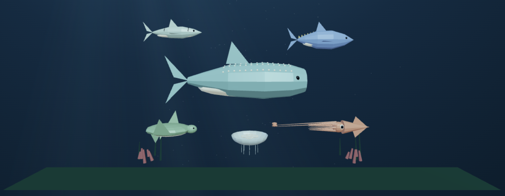
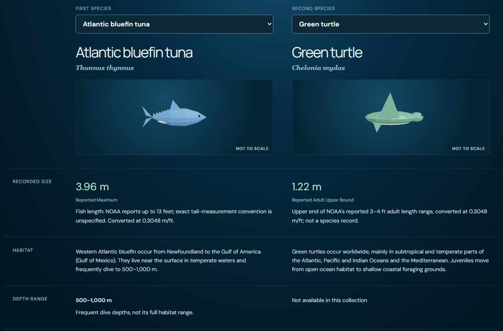
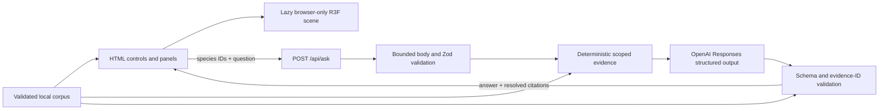

# Ocean Atlas

Ocean Atlas is an interactive marine field guide built with Next.js, TypeScript, React Three Fiber and a source-grounded AI question-answering path. It demonstrates browser/server boundaries, procedural WebGL graphics, typed data, API validation, provenance and evaluation.

The collection contains six stylised procedural animals: Atlantic salmon (*Salmo salar*), Atlantic bluefin tuna (*Thunnus thynnus*), whale shark (*Rhincodon typus*), giant squid (*Architeuthis dux*), green turtle (*Chelonia mydas*) and moon jelly (*Aurelia aurita*). It is an educational collection, not an ecosystem simulation or anatomical reconstruction.

## Preview





## Run locally

Use Node 24 LTS. Node 22.12 or later also meets the declared dependency requirements.

```sh
npm ci
npm run dev
```

Open [http://127.0.0.1:3000](http://127.0.0.1:3000). The explorer, field notes and comparison page work without an API key. Development and production scripts bind to loopback; do not expose the development server through a public tunnel.

Dependencies are pinned in `package-lock.json`. `.npmrc` uses npm's legacy peer resolver because npm 10's optional Expo peer graph failed during the original clean installation; Expo and React Native are not project dependencies.

### Optional local AI

Copy the example environment file and edit the copy locally:

```powershell
Copy-Item .env.example .env.local
```

```dotenv
OPENAI_API_KEY=your-key-goes-here-locally
OPENAI_MODEL=gpt-4.1-mini
AI_ENABLED=true
```

Never paste a real key into chat, commit `.env.local`, or expose it through a `NEXT_PUBLIC_` variable. Stop any `npm start` preview and restart with `npm run dev` after changing the environment.

Production AI is deliberately disabled, including `npm start` and Vercel, even if a key and `AI_ENABLED=true` are present. The project has no authentication or durable rate limiter, so enabling a public paid endpoint requires deployment-supported abuse controls first.

## Features

- **Explore:** select a procedural animal mesh or accessible HTML species control. Labels appear on hover or keyboard focus and remain for the selected animal. Camera framing accounts for the information panel; Explore uses display-friendly scale and discloses that choice.
- **Scenery:** a procedural seabed, coral, seaweed and decorative fish school frame the scene. Animation mutates Three.js refs and respects pause and reduced-motion settings.
- **Compare:** select two different species in an aligned side-by-side table. Each model preview is independently framed and labelled “Not to scale.” Measurement basis and definitions remain visible because maxima, adult-range bounds, fish length, squid total length and jelly bell diameter are not directly equivalent.
- **Field notes:** facts and source links are ordinary HTML backed by the local corpus and remain available after a scene failure.
- **AI guide:** ask about one selected species or explicitly add a second. Requests are independent and have no conversation memory.

## Architecture



`components/Explorer.tsx` owns selection, mode, the comparison table and normal UI. `OceanScene.tsx` and `SpeciesPreview.tsx` are client-only R3F canvases. `Animals.tsx` builds the six low-poly silhouettes and animates them with delta-based ref mutations. DPR is capped at 1.5; there are no textures, shadows or post-processing packages.

`lib/corpus.ts` contains the runtime-validated corpus. `lib/contracts.ts` defines strict request and answer contracts. `server/pipeline.ts` validates input, retrieves evidence and validates model output; `server/openai.ts` is the SDK adapter; `server/runtime.ts` is the server-only credential boundary.

Retrieval is deterministic species filtering, not semantic search. A request selects one or two known species, then evidence is included in stable round-robin order within 12,000 UTF-8 bytes. The model receives no browsing tools, browser-supplied evidence or previous conversation.

The server rejects invalid output, unknown or out-of-scope evidence IDs, and non-abstaining answers without citations. Citation text and URLs are resolved from the local corpus. Valid citation IDs establish provenance links; they do not prove that every generated claim follows from the evidence.

### Request boundaries

| Boundary | Behaviour |
| --- | --- |
| HTTP body | JSON only; 4,096 bytes including streams; 5-second read deadline |
| Question | Trimmed, 1–800 characters; strict object |
| Species | 1–2 distinct known IDs |
| Evidence | 12,000 serialized UTF-8 bytes |
| Model | 1,000 output tokens; 20-second deadline; no SDK retries |
| Browser | 25-second abort; controls disabled while pending |
| Persistence | No accounts, application database or conversation history; request uses `store:false` |

## Data provenance

The current corpus contains **6 species, 9 sources and 35 evidence records**, version `2026-09-12.2`. Sources include NOAA Fisheries, Smithsonian Ocean, Florida Museum, Georgia Aquarium, the Natural History Museum in London and Aquarium of the Pacific. Every evidence record references source metadata with publisher, URL and access date.

Unknown numeric depths remain `null`. Size records retain their source qualifiers and measurement definitions. No photographs, downloaded textures or third-party 3D models are redistributed. See [ATTRIBUTION.md](ATTRIBUTION.md).

## Verification and evaluation

```sh
npm run typecheck
npm run lint
npm test
npm run eval:offline
npm run build
```

`npm test` uses mocked providers and makes no paid requests. `npm run eval:offline` runs **22 mocked pipeline checks**: 12 factual, 4 comparison, 4 unsupported and 2 prompt-injection cases. The set includes focused green-turtle and moon-jelly measurement cases. Offline answers are constructed from each case's expected facts, so these results test validation, retrieval, reporting and citation plumbing only. They are not model-accuracy results.

Paid live evaluation is explicit:

```sh
npm run eval:live
```

It reads `.env.local` and sends 22 sequential model requests with no automatic retries. Review cost and cases before running it. No live evaluation or human factual grading has been completed. Automated citation and schema checks must be distinguished from human review of factual support, relevance and qualifiers.

See [docs/VERIFICATION.md](docs/VERIFICATION.md) for the current command record and known gaps. Current rendering and bundle measurements are pending; the obsolete four-species measurements were removed.

## GitHub Pages

The Pages build is separate from the normal Next.js server build:

```sh
npm run build:pages
```

It copies only the static app shell and shared browser/data modules into an ignored `.pages-staging/` directory, substitutes a static homepage with `aiEnabled={false}`, and runs Next.js with `output: "export"` and `basePath: "/Ocean-Atlas"`. The normal source tree is not renamed or deleted. API routes, the development guide fixture and server-only AI modules are absent from the exported `out/` artifact. The build script checks the hosted-demo notice, base-path-prefixed JavaScript references, referenced files and excluded routes.

The workflow in `.github/workflows/pages.yml` runs `npm ci`, type checking, lint, unit tests and the normal production build for pull requests and pushes to `main`. A successful push to `main` additionally creates and deploys the static Pages artifact. Pull requests never deploy.

Before the first deployment push, open **Settings → Pages** in `akmal-shaik/Ocean-Atlas` and select **GitHub Actions** as the source. Then push the workflow to `main`. A successful deployment is expected at `https://akmal-shaik.github.io/Ocean-Atlas/`; this README does not claim that URL is live before the workflow succeeds.

The hosted demo is static and labels the AI guide unavailable. To use AI, run the project locally with the opt-in environment setup above. Never add an API key to GitHub Pages, repository variables or client-side environment variables.

## Publication posture

The static explorer can be published with AI disabled. Keep `AI_ENABLED=false` and do not configure an API key in a public deployment. Before any public paid AI endpoint, add and verify authentication or a durable deployment-supported rate limiter before provider invocation.

Known limits include a small static corpus, no semantic ranking, no multi-turn context, illustrative anatomy, no live-model quality results, no public AI abuse controls, and no physical-device, screen-reader or cross-browser performance survey.

This project was developed with AI assistance. Source publications and dependencies retain their own rights; original project code is available under the MIT licence.
